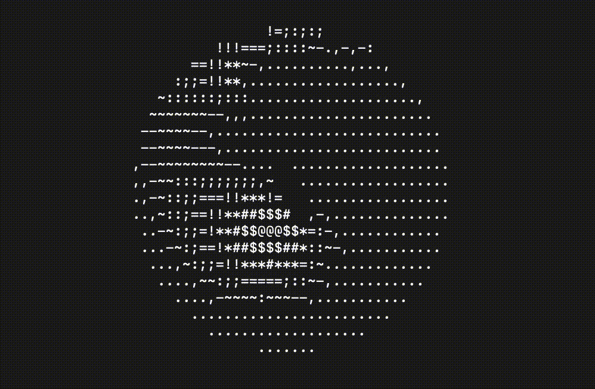

# Mojonut
Mojonut - A mojo implementation of donut.c

## Inspiration
The work in this repository is heavily influenced by Andy Sloane in [donut.c](https://www.a1k0n.net/2011/07/20/donut-math.html). 

## How to run
To run the code, simply run `mojo build donut.mojo` and then run the executable.

## Extra
This isn't really meant to be useful for anything, just a project to better understand Mojo (and to partcipate in the Modcon 2023 [competition](https://www.modular.com/blog/modcon-mojo-contest)). Contributions which improve the code to be more "Mojo-like" are certainly welcome! Also not that there are a couple of bugs that I couldn't quite iron it in time for the deadline.